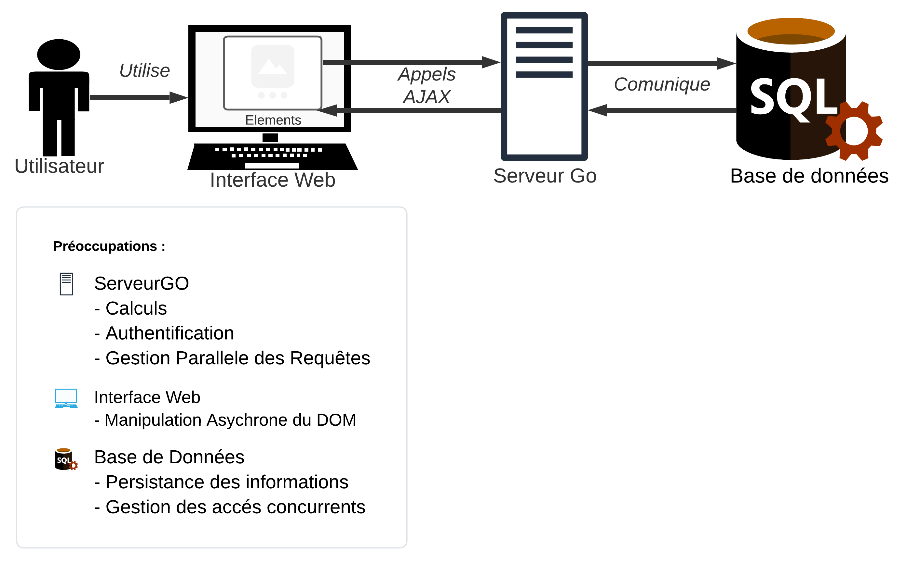
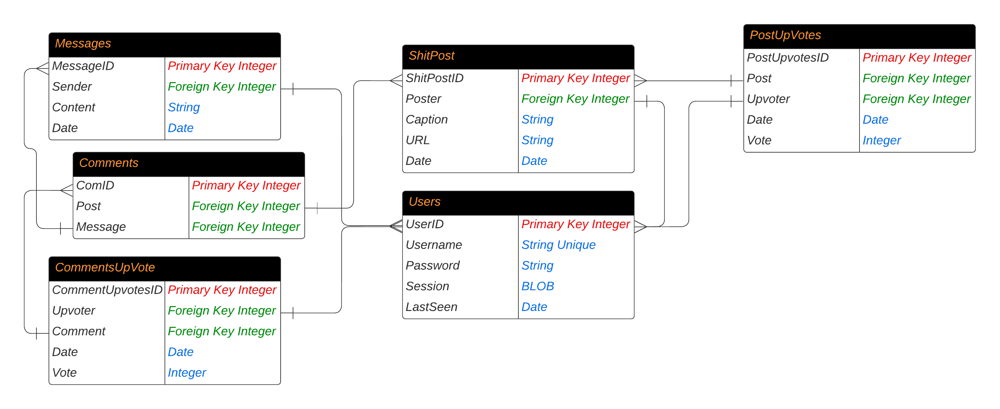

\pagebreak

# Description L'application
**ShitPostLand** est un mini réseau social centré autour des shitposts. L'application permettra à ses utilisateurs de créer des comptes, de se connecter, de publier des messages, de commenter des messages, d'upvoter et downvoter des contenus.
**ShitPostLand** est basé sur un système de capture de shitpost aléatoire récupéré depuis une API externe l'objectif étant de mettre en avant les meilleurs shitposts et utilisateurs.

## Fonctionnalités Proposées
- Création de compte
- Suppression de compte
- Connexion avec session persistante
- Déconnexion
- Capture de shitpost aléatoire
- Upvote et downvote de shitpost
- Commentaire de shitpost
- Upvote et downvote de commentaire
- Affichage de Profil
- Affichage de shitpost capturé
- Système de Top des meilleurs shitposts
- Système de Top des meilleurs utilisateurs

## L'API Externe

L'API externe utilisée est celle de [thedailyshitpost.net](https://thedailyshitpost.net/api) cette API REST permet l'accés a un collection catalogue de shitpost sous différents formats (GIF, Image, Vidéo, Texte, etc...) dans le cadre de notre application nous avons choisi de récupérer des images et des GIFs.
Un appel à l'API externe a chaque demande de shitpost aléatoire nous renvoie un JSON contenant les informations du shitpost ainsi que l'URL de l'image ou du GIF.

### Disclaimer
Il est important de noter que l'API externe utilisée est une API publique et gratuite, et mise a disposition par une personne ou organisation tierce, nous ne pouvons donc pas garantir la disponibilité de permanente de l'API ou la modération des contenus.

\pagebreak

## Cas d'utilisation

**ShitPostLand** possède 2 types d'utilisateurs le visiteur et l'utilisateur connecté.

### Visiteur

L'utilisateur non connecté ne peut pas directement interagir avec la communauté, il peut seulement se connecter, créer un compte ou observer les meilleurs posts et utilisateurs.
Le visiteur peut également observer des posts aléatoires

### Utilisateur connecté

L'utilisateur non connecté à lui accès à toutes les fonctionnalités de l'application.

\pagebreak

# Architecture



## Architecture Backend
Lors de la conception de l'architecture du backend nous avons choisi d'utiliser le langage GoLang pour la gestion du serveur HTTP et SQLite pour la base de données.
Ces choix ont été motivés par la simplicité de GoLang et la facilité de déploiement et d'utilisation d'SQLite.

### Serveur

Pour le serveur nous avons opté pour une architecture de type service, c'est-à-dire que chaque fonctionnalité de l'application est implémentée sous la forme d'un endpoint HTTP `app/api/*` qui est appelé par le client.

Sur chaque endpoint nous avons un handler qui va récupérer les données de la requête HTTP, les traiter et renvoyer une réponse au client.
En s'inspirant du cours de PAF chacun des formats de requête et de réponse est encodé via une structure go et donc un type dans le fichier [`inoutFormats.go`](../Dev/backend/Helpers/inoutFormats.go).

Ceci nous permet de réduire la vérification des JSON requêtes à une simple vérification du type.

Pour ne pas alourdir ce rapport, nous n'allons pas détailler la mise en œuvre de chaque JSON mais nous vous invitons à consulter le code source du backend.

#### Les requêtes
sont envoyées au format JSON et dependent du endpoint ciblée.
Voici un exemple de requête pour le service `/api/login`:

```json
{
    "login" : "admin",
    "mdp" : "admin"
}
```

#### Les réponses
sont envoyées au format JSON et toute respectent la forme suivante:

```json
{
    "Success": bool,
    "Message": string,
    "Result": interface{} // Peut être n'importe quel type JSON
}
```

#### Services

Voici la liste exhaustives des services implémentés:

**GET :** Les services sans paramètres

- `/api/logout` : Déconnecte l'utilisateur.
- `/api/random_shitpost` : Récupère un shitpost aléatoire depuis l'API externe.


**POST :** Les services avec effets de creation

- `/api/create_account` : Crée un compte utilisateur.
- `/api/save_shitpost` : Capture un shitpost dans la base de données.
- `/api/post_comment`: Poste un commentaire sur un shitpost.
- `/api/post_comment_vote`: Applique un vote sur un commentaire.
- `/api/post_shitpost_vote`: Applique un vote sur un shitpost.

**PUT :** Les services avec paramètres

- `/api/login` : Connecte un utilisateur.
- `/api/get_public_profile` : Récupère le profil public d'un utilisateur.
- `/api/get_saved_shitpost` : Récupère un shitpost sauvegardé.
- `/api/get_comments` : Récupère les commentaires d'un shitpost.
- `/api/search` : Recherche de shitpost ou d'utilisateur.
- `/api/get_comment_list` : Récupère une liste de commentaires.
- `/api/get_saved_shitpost_list` : Récupère une liste de shitposts.
- `/api/get_top_users` : Récupère une liste des meilleurs utilisateurs.
- `/api/get_top_shitposts` : Récupère une liste des meilleurs shitposts.

**DELETE :** Les services avec effets de suppression

- `/api/delete_account` : Supprime un compte utilisateur et toute les données associées.

#### L'Authentication
pour la mettre en place nous avons choisi d'utiliser des sessions persistantes, c'est-à-dire que lors de la connexion d'un utilisateur nous créons un token de session JWT crypté et signé avec une clé secrète.

Ce token est ensuite stocké dans un cookie HTTP qui est renvoyé à chaque requête par le client et dont l'intégrité est vérifiée par le serveur.

Toujours inspiré par le cours de PAF chaque endpoint nécessitant une authentification est représenté par le type `AuthServiceHandle` ceci permet lors du développement d'un nouveau service authentifié de forcer le passage par un middleware de vérification de l'authentification.


### Base de données

Pour la base de données nous avons pris le parti de stocker les données de l'application dans une base de données relationnelle.\
Dont voici le schéma:



Nous avons choisi de stocker les données de l'application dans une base de données relationnelle pour plusieurs raisons.
Mais la principale est qu'il s'agit du format de stockage dont nous avons le plus l'habitude, nous évitant d'apprendre un nouveau format de stockage et les techniques associées.
Il nous est néanmoins nécessaire de critiquer notre schéma de base de données qui a cause d'un trop grand nombre d'indirections  rend les requêtes SQL complexes et lourdes.

Par manque de temps a cause de nos autres projets universitaires nous n'avons pas pu redesigner notre schéma de base de données pour le simplifier ou opter pour un autre format de stockage tel que NoSql.

## Architecture Frontend
Pour le front, nous avons décidé d'utiliser le framework React avec TypeScript. Le choix de React était fait, car cela est le framework le plus utilisé et cela nous a intéressé de l'apprendre et aussi, car au cas des problèmes nous aurions pu facilement trouver des ressources en ligne pour nous guider.

Nous avons aussi utilisé la librairie MUI pour avoir des composants de style Material, car nous avions envisagé notre application avec ce style et nous ne voulions pas recréer ce style entièrement nous-même.

Pour le bundler et outil de construction nous avons utilisé **Vite**, car avec son serveur de développement il nous permettait de voir les changements qu'on avait réalisé instantanément même sans rafraîchir la page.

### Les Composants
#### Main
> code source dans `Dev/frontend/src/views/Main.tsx`

Cela est la page principale de notre application et le responsable de la gestion du profil courant et de la gestions des onglets.

##### Gestion du profil courant
Le contenu de chaque onglet est un composant séparé. Comme toutes les interactions, à l'exception de la visualisation simple, dépendent d'un profil connecté, nous avons décidé de récupérer cette instance de profil dans le composant `Main` et de donné cette instance (et son setter) comme paramètres pour les autres composants.

Comme nous avons utilisé le hook `useState` de React pour stocker le profil courant, au cas où de changement dans les donnée du profil, tous les composants nécessaires vont réaliser un nouveau rendu. Cela permet d'avoir la même instance de profil dans tous les composants qui dépendent de cela sans un appel au backend pour chaque composant.

\pagebreak

##### React Router et les onglets
En utilisant `React Router`, nous avons réussi à manipuler les routes de notre application en changeant les onglets sans recharger de page. La définition des toutes les routes possibles depuis le frontend est faite dans le point d'entrée de notre application : `Dev/frontend/src/app.tsx`.
Les quatres routes `/`, `/top`, `random` et `profile` nous mène tous vers le même composants `Main`, mais avec un paramètre `tab` différent.
Le composant `Main` affiche l'onglet corréspondant à la valeur de ce paramètre et en utilisant le hook `useNavigate` de React Router, change la route de l'application quand on change d'onglet, sans recharger la page.

#### Top posts

Dans cet onglets, d'abord, nous récupérons une liste d'ids des posts avec le plus de vote. La taille de cette liste est donnée dans l'appel AJAX, cela nous permet de récupérer plus de posts quand on en a besoin. Nous avons choisi de mettre 10 pour cette taille. Ensuite, nous récupérons les détails de ces posts avec une requête AJAX et nous créons une instance du composant `Post` pour afficher les détails de chaque post récupéré. Nous avons aussi un bouton `Load more posts` qui refait ces deux derniers appels en ajoutant 10 à la taille de la liste d'ids.

{ width=75% }

\pagebreak

#### Le Composant Post

Ce composant a deux modes d'affichage qui dépends de paramètres `randomMode`.

- Si `randomMode` est vrai, il affiche les boutons `Pass` et `Save` :
  - Le bouton `Pass` charge un nouveau post.
  - Le bouton `Save` créer en prenant le titre que l'utilisateur donne dans le pop-up sauvegarde le post dans le profil de l'utilisateur connecté.
- Si `randomMode` est faux, il affiche :
  - Le titre,
  - La date de publication,
  - Les boutons de vote et des commentaires.

**Note** : le contenu de l'onglet `Random Post` est une instance de ce composant avec le paramètre `randomMode` mis à vrai.

{ width=75% }

#### Logout

Ce composant envoie une requête vers `/api/logout` et affiche son résultat.

{ width=65% }

\pagebreak

#### Search

Pour afficher les résultats des recherches, nous avons créé deux nouveaux composants qui prennent la liste d'ids des posts / profils et après ayant récupérées les bonnes données depuis le backend, affiche son contenu.
En revanche, nous pensons que cela était mieux de réutiliser le composant des post pour les posts et de créer un paramètre avec lequel on peut décider le style, et de créer un nouveau composant pour les profils trouvé, ce qu'on aurait pu utiliser dans l'onglet `Profile` aussi. À cause du manque du temps nous n'avons pas pu réaliser ce changement.

{ width=75% }


#### Profile

Cet onglet permet de voir les posts que le profil courant a sauvegardé, de supprimer son compte et de se déconnecter. Tous les posts affichés sont des instances du composant `Post` et les informations concernant le profile courant sont récupérés depuis le composant `Main`

{ width=75% }

\pagebreak

#### Login

Le fonctionnement de cet composant d'afficher les champs nécessaires pour se connecter ou créer un nouveau compte, mais aussi de valider si tous les champs avant d'envoyer la requête pour se connecter / créer un nouveau compte. La gestion des modes Login / Créer un compte sont réaliser par un hook `useState` de React.

{ width=75% }


#### Le Composant Comments

Ce composant prend en paramètre la liste des commentaires à afficher, récupère le contenu de ces commentaires et les affiche.
S'il y a un profil actuellement connecté, il affiche aussi un champ de texte avec un bouton pour créer un nouveau commentaire.

{ width=75% }

\pagebreak

### Composants avec les points d'api qu'ils accèdent
- `Main`:
  - `/api/get_private_profile`
  - `/api/get_public_profile`
  - `/api/random_shitpost`
- `TopPosts`:
  - `/api/get_top_shitposts`
  - `/api/get_saved_shitpost_list`
- `Post`:
  - `/api/post_shitpost_vote`
  - `/api/save_shitpost` (pour l'onglet Random Post)
  - `/api/random_shitpost` (pour l'onglet Random Post)
- `Comments`:
  - `/api/post_comment_vote`
  - `/api/post_comment`
  - `/api/get_comment_list`
- `Search`:
  - `/api/search`
  - `/api/get_public_profile`
  - `/api/get_saved_shitpost_list`
- `Profile`:
  - `/api/get_saved_shitpost_list`
- `Login`:
  - `/api/login`
  - `/api/create_account`
- `Logout`:
  - `/api/logout`


\pagebreak

# Description de l'archive

Afin de lancer le projet en local, il faut se placer à la racine du projet et lancer la commande suivante.

```bash
  bash run.sh
```

Et ensuite se rendre sur l'adresse suivante: [http://localhost:25565/](http://localhost:25565/)

## Dépendances
Voici la liste des dépendances nécessaires pour lancer le projet:

### Installation manuelle

- SQLite3 : `sudo apt install sqlite3` (Linux)\newline
  ou [https://www.sqlite.org/download.html](https://www.sqlite.org/download.html) (Windows)\newline
  ou `brew install sqlite` (MacOS)

- GoLang : [https://golang.org/doc/install](https://golang.org/doc/install)

- NPM : `sudo apt install npm` (Linux)\newline
  ou [https://nodejs.org/en/download/](https://nodejs.org/en/download/) (Windows) \newline
  ou `brew install node` (MacOS)

### Installation automatique

- Sqlite3 Driver Pour Go
- jwt-go : Implémentation de JWT en Go


## Code Source

Le code source du projet se trouve dans le dossier `Dev/` et est divisé en 2 sous-dossiers:

### Source Frontend

Code source du client écrit en ReactJS.

- `src/components`: Les différents composants utilisés dans les pages.
- `src/styles`: Les fichiers css pour le style des pages.
- `src/utils`:
  - `serverFunctions.ts`: Les requêtes ajax.
  - `types.ts`: Les définitions des types.
  - `utils.ts`: Autres fonctions qui sont utilisées dans plusieurs composants
- `src/views`: Les pages de l'application
- `src/app.tsx`: Le point d'entrée de l'application, contient aussi la définition des routes.

### Source Backend

Code source du serveur écrit en GoLang.

  - `Helpers` :
    - `errors.go` : Code de gestion des erreurs.
    - `inoutFormats.go` : Contient les formats d'entrée et de sortie des requêtes JSON encodés en structure GoLang.
  - `Database/` : Manipulation de la base de données SQLite.
  - `auth.go` : Manipulation et vérification des tokens JWT.
  - `handlers.go` : Handlers HTTP.
  - `server.go` : Paramétrage du serveur HTTP.

# Conclusion

Ce projet étant notre premier projet de développement web, nous avons eu beaucoup de difficultés à le réaliser.
De nombreuses technologies nous étaient inconnues et nous avons dû les apprendre en parallèle des cours et des autres projets.
Cependant, ce projet nous a permis de mobiliser de nombreuses compétences acquises au cours de notre formation notamment les cours de PAF et MLBDA et de comprendre par la pratique les concepts abordés dans ses cours.
C'est pourquoi nous sommes satisfaits du résultat final et nous espérons que vous le serez aussi.